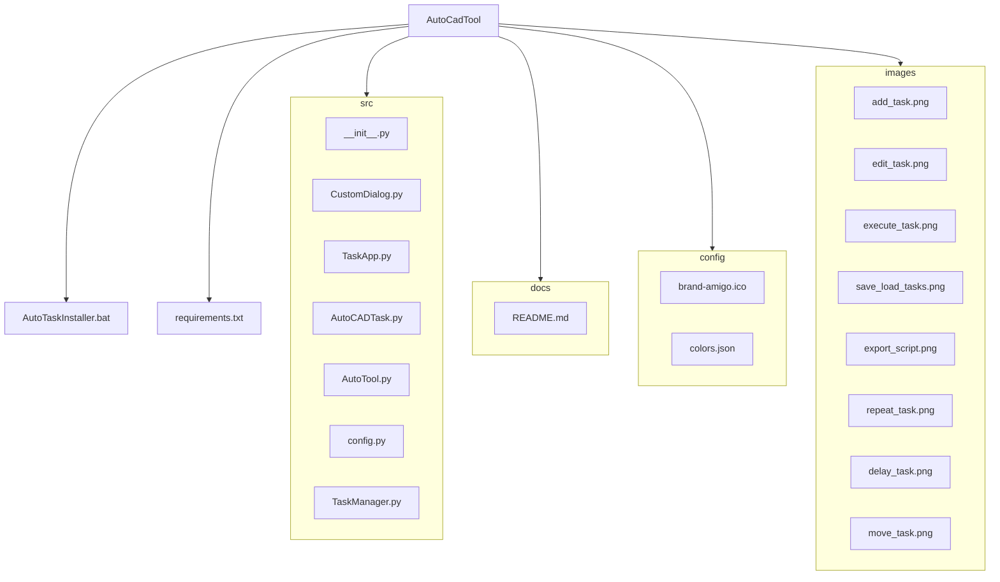

# AutoTool

Pff, como si alguien leyera estas cosas... 🙄

### Propósito de la Aplicación

AutoTool es una herramienta de automatización para tareas pensada principalmente para AutoCAD (puede ser empleada para otros propósitos). Permite a los usuarios crear, editar y ejecutar una serie de tareas automatizadas, ahorrando tiempo y esfuerzo en tareas repetitivas.

## Instalación rápida

1. Ejecutá el instalador
2. Disfrutá del exe

## Configuración (opcional)

Antes de instalar podés personalizar:

### En el archivo `colors.json` puedes:

- Cambiar la paleta de colores

## Estructura del proyecto

## Archivos Python

- **AutoTool.py**: Archivo principal que inicia la aplicación.
- **TaskApp.py**: Contiene la clase principal de la interfaz gráfica y la lógica de la aplicación.
- **AutoCADTask.py**: Maneja la ejecución de las tareas automatizadas.
- **CustomDialog.py**: Define diálogos personalizados para la entrada de datos del usuario.
- **TaskManager.py**: Gestiona la creación, edición y eliminación de tareas.
- **config.py**: Contiene configuraciones y rutas de archivos.

## Manual de Uso

### 1. Iniciar la Aplicación

Al ejecutar `AutoTool.exe`, se abrirá la ventana principal de la aplicación.

### 2. Mover Tareas

Puedes cambiar el orden de las tareas en la lista usando las flechas de subir y bajar. Selecciona una tarea y usa las flechas para moverla hacia arriba o hacia abajo en la lista.

### 3. Añadir Tareas

Para añadir una tarea, haz clic en el botón "Añadir" y selecciona el tipo de tarea que deseas agregar.

### 4. Editar Tareas

Para editar una tarea, selecciónala de la lista y usa el botón "Editar Tarea" para cambiar sus propiedades.

### 5. Repetir Tareas

Puedes configurar cuántas veces deseas que se repita la serie completa de tareas. Para ello, usa el botón "Repetir" y especifica el número de repeticiones.

### 6. Retraso entre Tareas

Puedes establecer un retraso entre la ejecución de cada tarea. Para ello, usa el campo "Delay" y especifica el tiempo en segundos.

### 7. Ejecutar Tareas

Para ejecutar las tareas, haz clic en el botón "Ejecutar". Puedes pausar o detener la ejecución en cualquier momento.

### 8. Guardar y Cargar Tareas

Puedes guardar tus tareas en un archivo para cargarlas más tarde. Usa los botones "Guardar Tareas" y "Cargar Tareas" en el menú "Archivo".

### 9. Exportar Script

Puedes exportar tus tareas a un script de Python para ejecutarlas fuera de la aplicación. Usa el botón "Exportar Script" en el menú "Archivo".

### 10. Ejecución Única

Si deseas que una tarea se ejecute solo una vez, asegúrate de no configurar ejecución única para esa tarea.

## Paleta usada
[Rosepine](https://rosepinetheme.com/palette/)

## Icono
[TablerIcons](https://tablericons.com)

## Contacto

Created by TRC 
✉️ t.aguinaga@alumno.um.edu.ar

#### Fieles Ayudantes:
- ClaudeIA
- GitHub Copilot
- ChatGpt

#### Equipo de testing:
- Josefina Porolli